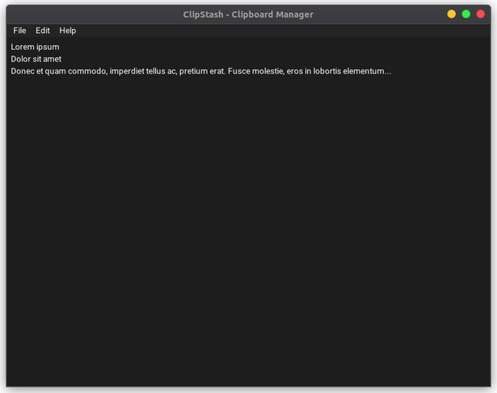

# ClipStash



## Information

A cross-platform clipboard manager written in Rust and imgui-rs, which supports both Windows and Linux.

## Features

- Temporary / Permanent storage
- Run at startup
- Trimming long text
- Windows / Linux support


## Compiling & Running

### Windows

```sh
cargo build
```
```sh
cargo run
```

### Linux (Ubuntu)

```sh
sudo apt install build-essential clang libappindicator3-dev libgtk-3-dev
```
```sh
cargo build
```
```sh
cargo run
```

## License

This project is licensed under the MPL-2.0 license - see the [LICENSE.md](./LICENSE) file for details.
